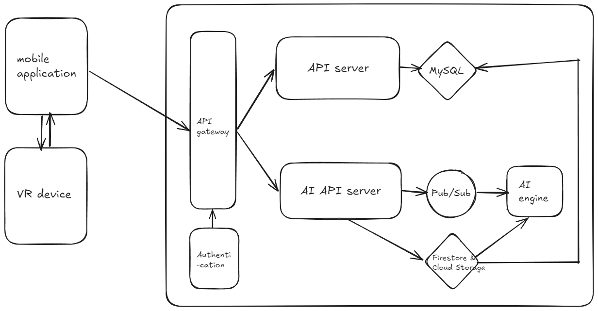

# 글을 작성하는 이유

이제 더 이상 학부생이 아니기 때문에 솔루션 챌린지에 참여할 수는 없지만, 다음 번 솔루션 챌린지 혹은 이와 비슷한 성격의 공모전에 참가하는 이들에게 도움이 될까 하여서 작성하게 되었다.
두 번의 솔루션 챌린지를 참여하면서, 나름대로의 배운 점들과 아쉬운 점들이 있었기에 개인적으로 정리를 하며, 이러한 경험이 다른 누군가에게 도움이 되었으면 하는 뜻도 있다.

또한 [Competition 카테고리](/?category=Competition)의 이전의 글들에서 출품작 자체와 아이디어 등에 대해서 고민을 많이 하였기도 하고, 이 글을 읽는 다른 사람들은 내가 서버 사이드를 구현하고 설계하는 과정에서 한 실수들을 되풀이 하지 않았으면 하는 마음에서 구현 상의 아쉬움을 위주로 작성해보겠다.

## 본격적으로 글을 작성하기 전에,

개인적으로 2024 솔루션 챌린지는 [호랑이사진관](/recap/horangstudio/)[[v1]](/develop/horangstudio-architecture/)[[v2]](/develop/horangstudio-architecture-v2/)과 더불어서 학부에서 진행한 프로젝트 중 가장 진심으로 몰입했던 경험이었다.
물론 학기가 시작되고 인턴을 가게 되면서는 방학기간 만큼의 몰입도를 당연히 보여주지 못했지만, 방학동안 정말 재밌게 만들었던 프로젝트라고 자신할 수 있다. 정말 그 기간 동안은 이 프로젝트에 미쳐서 회의하고 개발했던 기억이 난다. 주제도 의미있었고, VR 기기를 머리에 쓰고 휘적거리는 것도 재미있었다.

이 뒤로는, 전반적으로 아쉬웠던 점과 아키텍쳐에서 잘못된 선택이라고 느껴지는 부분들에 대해서 얘기할 예정이라 한번 쯤 적고 싶었다 :)

# 출품(RememVR) 및 성적

RememVR이라는 출품명으로, 치매환자를 대상으로 한 회상치료를 중심으로 아이디에이션을 하였다.
3D 모델링 AI(3DGS, Nerf)모델을 기반으로 사람 및 배경의 동영상을 기반으로 이를 VR로 변환하고, 회상치료를 경험시켜주는 것이었다.
치매환자들을 돌보는 가족들이 가장 가슴 찢어지는 순간이 환자가 본인을 기억하지 못하는 순간이라는 말을 들은 적이 있었는데, 그것에서 나온 아이디어였다.

아래는 우리 팀의 데모영상들이다.

위의 출품작으로 성적은 글로벌 탑100에 입상하게 되었다.

## 아쉬운 점

솔루션 챌린지에서 아쉬웠던 점들이 크게 두 가지가 있는데, 아래와 같다.

### 4월 이후

4월에 Top100 메일이 왔으나 마냥 기뻐할 수는 없었다.
필자가 3월 부터 인턴을 가기도 했고 4학년이 2명에, AI멤버는 연구실 일정 때문에 너무 바빴던 상황이었다.
또, PM/디자인을 맡아준 친구는 다른 공부를 계획하고 있었던 상황이었다.

이런 상황에서 나름대로의 최선을 다하기는 하였으나, 팀원 모두 각자의 100%의 능률을 내는 것은 당연히 불가능했다.
그 결과 Top100에서 여정을 마치게 된 것이 조금 아쉽다. Top10에 정말 가보고 싶었는데, 어쩔 수 없었지만서도 너무 아쉬웠다.

### 미완성

또한 이건 아래와도 이어지는 내용인데, 기획한 모든 기능이 완성된 상태로 제출하지 못하였다. 이 부분도 상당히 아쉽다.

# 전체 아키텍쳐

우선 제출 당시 아키텍쳐는 아래와 같았는데, 현재로서는 딱히 마음에 들지는 않는다. 또한 설계 뿐 아니라,
기획 및 구현의 우선순위를 제대로 설정하지 못한 것 같아 아쉬움이 든다.

어떠한 부분들이 그랬는지 하나하나 뜯어보자.

## 인증 (공부 vs 생산성)

우선 인증부분이다. 이때 당시에 Google OAuth를 이용하여 인증을 진행하였는데, 직접 `NestJS`에서 `passportJS`를 이용하여서 OAuth 관련한 코드를 작성하였다.
물론 이는 OAuth에 대한 개념은 있었으나, 실제로 한 번도 직접 구현해보지 않은 상태에서 공부를 위한 선택이었다. (이 때가 아니면 또 언제 직접 구현도 해보고 그러겠는가?)

공부로서는 아주 훌륭한 선택이었지만, 한정된 기간안에서 기능을 구현하고 MVP를 만들어야 하는 상황에서 좋은 선택이었는지는 고민해볼 여지가 있다.
솔루션 챌린지 전에 OAuth를 직접 연습삼아 구현해보고, 솔루션 챌린지에서는 인증은 기존의 제품에 위임한 후, 핵심 기능 구현과 아이디어 등에 더 집중했어야 하지 않나 싶다.

## 메일 인증 (MVP)

보호자와 피보호자 간의 연결을 위해서 "메일 인증"을 하기로 하였다.
커플앱인 비트윈을 생각하면 이해가 편한데, 즉, 회원 가입 후에 피보호자와 보호자의 직접적인 연결이 생기기 전까진 앱의 대부분의 기능을 사용할 수 없도록 기획했다.
직접적인 연결은 개인정보 이슈로 서로의 메일로 보낸 인증 버튼을 클릭하는 식으로 구현하였다.

여기까지는 좋지만, 과연 이 기능이 핵심 기능 위주로 MVP를 만들고 이를 기반으로 평가받는 행사인 솔루션 챌린지에서 유의미하게 영향력이 있는지 고민은 해봐야 할 것 같다.
실제로 꽤나 귀찮은 과정을 통해서 개발되기도 하였으며, 테스트하기도 까다로운 편이었다.

## 메세지 큐 (오버 엔지니어링?)

메세지 큐(사진상의 AI Scheduler)를 cloud function 및 redis로 구현하였다. 솔직히 호랑이 사진관에서 Redis Queue를 직접 구현해보며 데인 경험이 있기에, 굳이 또 구현하고 싶지 않았지만 사용하게 된 이유가 있기는 하다.

1. 3D 가우시안 스플래팅의 작업시간은 아주 길다. (사람의 경우 1~2시간, 배경의 경우 10시간 씩 걸리기도 한다.)
2. GCP Cloud Task(AWS SQS)를 사용하고 싶었으나, Timeout이 30분으로 정해져 있어서 사용하기 어려웠다.

이런 이유와 더불어 솔루션 챌린지의 컨셉에 맞춰 최대한 구글의 기술을 사용하려고 하다보니, 남는 옵션으로 Apache Kafka와 비슷한 GCP Pub/Sub만이 남게 되었다.
이벤트 브로커인 pub/sub으로 메세지 브로커의 역할을 하는 것은 물론 가능하지만, 당시에 한 번도 사용해본적도 없던 기술을 또 적용하는 것과 이렇게 까지 해야하나 하는 생각에 Cloud function으로 작성하였다.

다만, 이 부분에서는 여러 가치 판단이 따르겠지만 돌아간다면, pub/sub을 공부 삼아 써보는 것도 좋은 방식이지 않을까 싶다.

### 여담

그것보다는 더 중요한 점이 있는데, 사실 심사위원이 사용을 하기에, 직접 본인의 얼굴 등을 넣고 VR 생성요청을 보내는 경우 등을 생각해보아서 이 부분을 구현하였는데, 실제로 사용을 하시는 지는 모르겠다.
솔루션 챌린지만을 생각한다면, 음..., 그래도 구현하면서 재미는 있었다 ^^...

사실 이렇게 거대한 모델을 기반으로 솔루션 챌린지에 참가하는 경우를 거의 보지 못했다. 대부분의 경우 Cloud Task선에서 해결이 되거나, 혹은 외부 API를 호출하는 경우일 것이다.

혹시라도 이렇게 거대한 모델을 기반으로 출품한다면, 아래 몇 가지를 고민해보길 바란다.

1. 솔루션 챌린지 참가를 위해 구글에서 제공하는 크레딧으로는 GPU를 빌릴 수 없다. 즉, 개인이 GPU 이슈를 해결해야 한다.
2. 학부생이라면 연구실의 리소스를 교수님의 허락을 맡고 일부 켜놔야 하거나, 본인의 GPU서버를 오픈해야한다.
3. 이렇게 거대한 모델을 실제로 심사위원들이 돌릴지는 미지수이다. 최초 예선은 몇 천개의 서비스가 출품되고, Top100이라 해도 100개이다.

우리는 3)에서 기반하여 10시간이 넘는 VR생성을 심사위원들이 기다리기 힘들다는 판단하에, 추가적으로 우리의 얼굴과 고려대학교를 배경으로 해서 sample들을 미리 모든 유저들이 사용할 수 있도록 오픈해두었다.

## API Gateway

현재 `NestJS`로 작성된 `WAS`가 하는 일이 생각보다 많다. 관리 포인트가 너무 많아졌는데, 이를 최소한 MySQl과 firestore를 기반으로 둘로 쪼개고 그 앞에 API Gateway를 통해서 관리했으면 더 좋았을 것 같다는 생각이 든다.

이는 위의 인증에서와 이어지는데, 인증을 `firebase authentication`를 통해 위임했다고 가정하면, API Gateway와 연결하여서 특정 API에 대해 인증을 요구했다면 그 시너지가 더 컸으리라 생각된다.

(빠르게 그려보았다.)

# 기술을 선택한 이유, 상황

> 특정 개체가 특정 상황에서 유리하다는 것은, 다른 상황에서는 불리할 수 있다는 것이다.

꽤나 좋아하는 말이다.

특정 상황에는 그에 맞는 특정한 솔루션이 필요하다.
물론 일반적으로 "괜찮다"라고 평해지는 기술들이 있을 수 있지만, 기술을 선택하기 이전에 그에 대한 근거를 들 수 있도록 공부하고 연습하자.
이는 엔지니어로서의 역량을 키우는 데 도움이 될 것이다.

여담이지만, 면접을 준비하며 이력서에 나열한 기술들의 근거를 대기 위해 공부해보았는데, 그 과정에서 얻는 것들이 너무나도 많았다.
평소에도 여러 가능한 옵션들을 비교하고 각각의 특징과 장단점을 위주로 사고해야할 필요성을 느꼈다.
기술을 제대로 알아야만 객관적인 근거에 바탕하여 합리적인 의사선택을 할 수 있으니 말이다.
