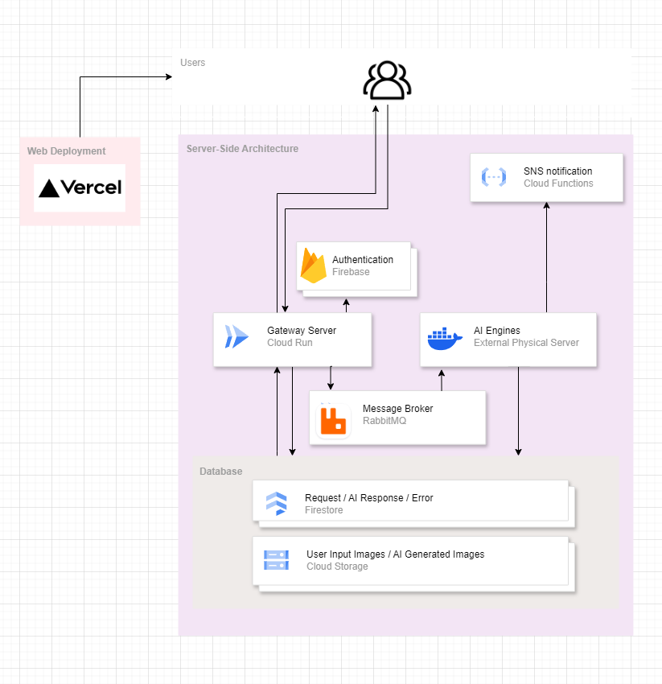
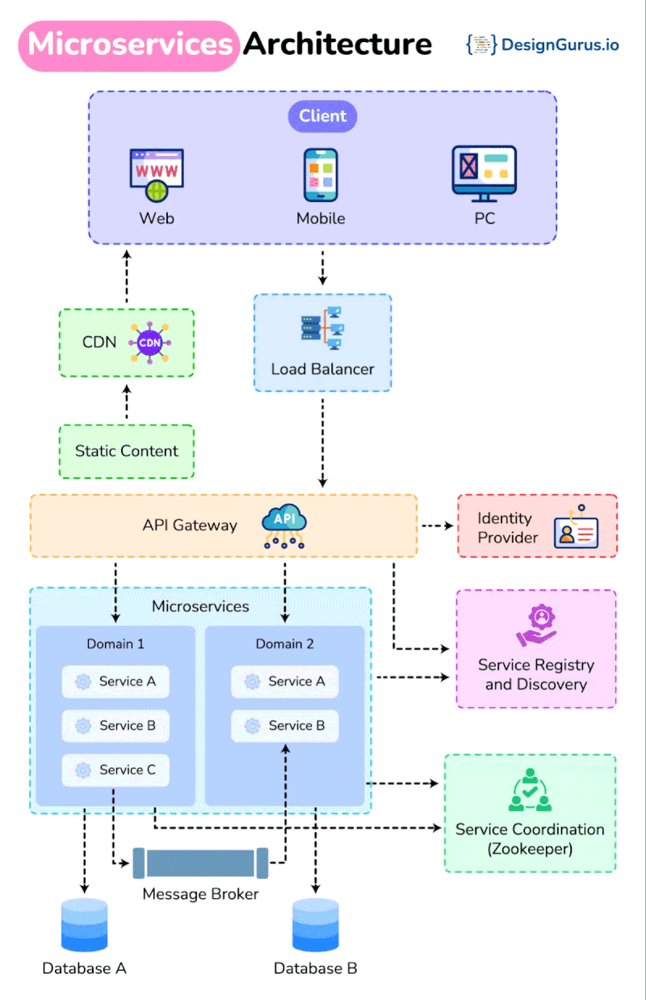
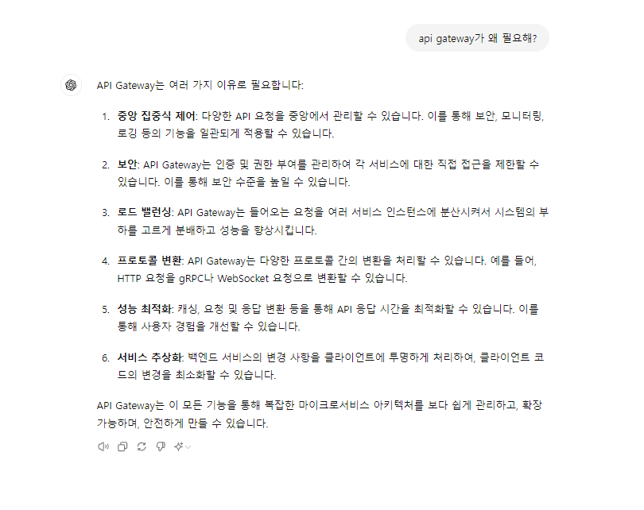

이 글은 GDSC 내부 메인 프로젝트였던 호랑이 사진관의 전반적인 (서버 사이드)아키텍처를 설명한다.

GDSC 고려대학교 챕터 내부적으로 호랑이 사진관 관련 후속 이벤트를 진행할 때, 개발자들이 이 글을 참고하며 v2 당시의 시스템을 이해하길 바란다. 혹시라도 다른 분들께서도 이 글을 읽고 도움을 받으신다면, 소소하게 기록을 남기는 나에게는 큰 영광이지 않을까 싶다.

# 현재 아키텍쳐

아래는 전반적인 호랑이 사진관 서버의 아키텍쳐이다.

파트 별로 중간중간 '왜 이렇게 했어야 했는지' 등에 대해서도 서술할 예정이다.

(후술하겠지만 MSA라고 표현을 하기에는 '컴포넌트들의 책임이 서비스 단위로 나뉘어져있는가/ 격리되어있는가' 의 측면에서 MSA라고 부르기엔 애매한 감이 있다.)

## Gateway Server

사실 명명을 Gateway Server로 하는 것이 맞는지는 모르겠으나, 크게 아래 세 개와 같은 책임을 갖는다.

1. client가 보내는 모든 요청은 이 서버를 거치며,
2. 일반적인 경우 Database에서 가져와 응답을 보내주고,
3. AI 엔진을 구동시켜야 하는 경우는 RabbitMQ에 위임한다.

그 중 3번의 과정에서는 Gateway Server는 RabbitMQ에 알리기만 하고, 그 뒤의 과정은 모두 AI 엔진 쪽에 위임한다. 즉 Gateway Server는 RabbitMQ에 보내는 순간부터 해당 task에 대한 상태를 잊는 것이다.

여담이지만, 원래는 java spring 기반으로 서버를 작성했지만, GDSC 고려대학교 내부에서 더 많이 사용되는 nodeJS의 nestJS로 서버를 마이그레이션 했다. 그러면서 이메일/SNS 알림 기능은 클라우드 서비스 등에 맡기거나 cloud function으로 빼버렸다. 인증을 Firebase Authentication에 맡기듯이 코드 베이스를 최대한 lean하게 가져가고 싶었다.

## AI Engine

AI Engine의 책임은 'AI 이미지 생성', '생성된 이미지 및 데이터 저장' 으로 크게 두 개이다.

AI Engine은 RMQ를 구독하고 있다가, task를 받을 수 있는 상태가 되면 해당 task를 받고 이미지를 생성한다. 순차적인 파이프라인을 그려보자면,

1. RMQ의 메세지에는 taskId를 기반으로 task에 대한 정보가 적혀있다.
2. 해당 정보들을 바탕으로 Cloud Storage에서 유저의 input 이미지를 받고, AI가 Image를 생성한다.
3. 생성이 성공적이었으면 Cloud Storage에 이미지를 저장하고 firestore에 data를 저장한다, 실패했으면 firestore에 error data를 저장한다.
4. 완료 후, SNS notification을 트리거한다.

## Cloud Storage & Firestore

이 DB 파트에서는 책임보다는 포인트들을 위주로 서술해보려고 한다.

Storage-Firestore의 multi transaction 처리를 신경썼다. 사실 transaction이라기 보다는 저 둘 간의 데이터 정합성을 고려했다는 표현이 맞다. 즉 Storage에 이미지는 업로드 했지만, Firestore에 데이터를 넣는 도중 오류가 났다면 Storage에 올라간 이미지도 삭제를 하겠다는 말이다. 이렇게 한다면 Storage-Firestore간 데이터의 정합성이 지켜질 수 있다.

gateway server와 AI engine의 쓰기 범위를 명확히 제한했다. gateway server는 firestore에서 reqeust에만 data를 작성하고, AI engine은 response와 error에만 작성한다. 동일하게 gateway server는 cloud storage의 user input관련해서만 데이터를 쓰고, AI engine은 AI generated image만 넣는다. 이렇게 쓰기 영역을 명확히 구분하여, 데이터의 무결성을 지킬 수 있었다. 물론, 필요에 의해 서로의 영역을 읽을 수는 있다.

## Rabbit MQ

직전 [v1](/develop/horangstudio-architecture)에서는 공부하며 만들어보겠다고, redis로 message queue를 만들고 scheduler를 만들어서 사용했지만, v2에서는 그냥 잘 만들어진 rabbitMQ를 사용하기로 했다.

또한 부스에서의 사진은 최우선순위로 빼야했기 때문에 그런 우선순위의 구현을 하기 싫어서도 있다. 위험부담도 있고.

GCP의 cloud task도 있고 AWS의 SQS도 있으나 rabbit MQ를 사용하게 된 이유는 최대한 플랫폼에 종속적인 무언가보다는 오픈소스 형식으로 시스템을 구성해야 나중에 돌려쓰기도 유리하지 않을까 생각이 들어서다.

우리의 서비스는 매일 켜지는 것이 아니고, 매번 클라우드도 새로 구성하니까 말이다.

# p.s. MSA best practice

이 사진은 최근에 MSA best practice라는 키워드와 함께 LinkedIn에서 봤었던 사진인데 한번 첨부해봤다.

이 사진을 토대로 호랑이 사진관의 아키텍처를 비교해보니 아래 두 개의 아키텍처에서 차이가 있는 듯 보였고, 왜 그런 차이가 생겼는지, 왜 호랑이 사진관에서는 위의 구조로 작성했는지에 대한 설명을 해보려고 한다.

## API Gateway

사용하지 않은 이유를 설명하기 위해, GPT를 동원해봤다.

1. 우리는 client가 요청을 보내는 endpoint가 gateway server 딱 하나이기 때문에 gateway를 둘 필요가 딱히 없다.
2. 유일한 open된 endpoint인 gateway server의 로드 밸런싱은 Cloud Run이 기본적으로 해준다.
3. 캐싱이 필요할 정도의 트래픽이 없다.

등등의 이유로 API Gateway를 사용하지 않았다.

## Database

원래 MSA라고 함은, 하나의 큰 서버를 서비스 단위로 분리하여 마이크로 서비스들로 서버 사이드를 구성하는 것이다. 그리고, 서비스들이 맡는 도메인에 따라 그 DB만 관리를 하게 되는 것이 MSA에서 권장되는 패턴이다.

하지만 우리는 gateway server가 AI engine과 유기적으로 움직여서 결국 'AI 프로필 이미지 생성' 이라는 하나의 서비스를 하기에 우리의 아키텍처가 MSA라고 부르기 애매한 면이 있다.

또한 그렇기 때문에 DB를 명확히 분리한다는 것이 사실상 불가능했다. 그래서 이 부분에서는 위에 언급한대로 쓰기 영역을 제한하여 데이터의 정합성이나 무결성 등을 보장하려고 하였다.
