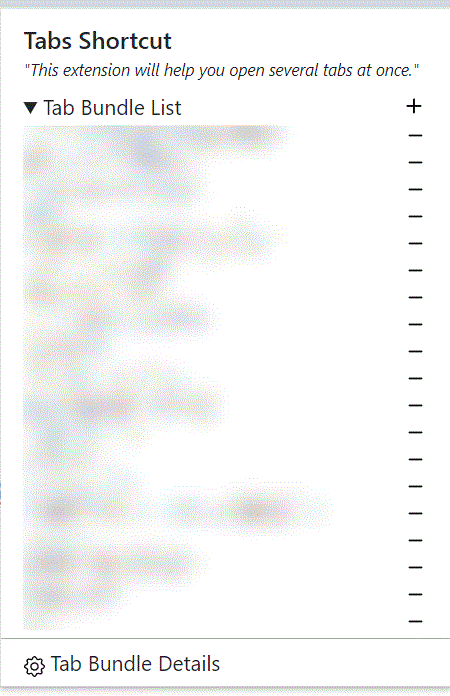

# 회고

> 이 포스팅에서는 나의 발전과정과 경험이 쌓여왔던 과정들을 시간 순서대로 적어볼까 한다.

웹 개발을 시작한지 2년이 조금 안된 것 같은데, 드디어 그 동안의 발자취를 정리하게 되었다.
개발을 시작하고 대부분의 시간을 군대에서 지내다보니 나름 특수한 케이스이기도 하고,
아무것도 모르던 수준에서 지금까지의 발전 과정이 상당히 의미있어서 기록을 해두고 싶었다.
물론 지금도 많이 부족하니, 앞으로도 더 노력해야겠다는 다짐과 함께 말이다.

원래 군대에서 개인적으로 프로젝트들을 할 때마다 README에 항상 느낀점을 적어두곤 하였는데,
다른 레포들에 묻혀버려서 포스팅에서 유기적인 타임라인 형식으로 한번 더 정리하게 되었다.
혹시라도 나의 경험들이 조금 더 궁금하다면 깃헙 레포에 들어가면 나름대로 그때의 고민들이 있을 것이다.
물론 아주 부끄러운 수준이지만, 이 또한 성장 과정이지 않을까...?

# 개발을 처음 시작하며

## 크롬 익스텐션

> _[소스 코드](https://github.com/woog2roid/tabs-shortcut-chrome-extension)_  
>   
> `[HTNL + CSS + JS]`

HTML, CSS, JS를 배우고 처음으로 만들어본 프로젝트이다. 학교 동기랑 같이 <u>[chrome extention get started](https://developer.chrome.com/docs/extensions/mv3/getstarted/)</u>를 읽으며 서로 각자의 주제를 잡고 확장프로그램을 만들었었다.
평소에 찾는 정보가 있으면 여러개의 탭을 띄워놓고 정보를 취합하곤 했었는데, 북마크 기능은 있어도, 탭 묶음 자체를 저장하는 기능이 없어서 만들게 되었다.
탭 묶음을 즐겨찾기처럼 한 번에 저장하고 한 번에 띄워주는 확장 프로그램이며, 최대한 사용법도 직관적으로 만들려고 노력했다.

사실 큰 기술적인 의미가 있는 프로젝트라기 보다는, 첫 웹 프로젝트를 흔하지 않은 주제로 성공적으로 마무리 한 것 같아서
나름 자부심이 있는 프로젝트이다.

## 격투기 프로젝트

> _[웹 사이트](https://mma.woog2roid.dev) | [소스 코드](https://github.com/woog2roid/mma-fighter-finder)_  
>   
> `Front: [React + styled-components]`  
> `Back: [nodeJS]`

리액트를 배우며 처음으로 만들어 본 웹앱 프로젝트이다.
북미의 sherdog을 제외하면 격투기 선수들의 정보를 찾을 수 있는 사이트들이 없어서, 직접 만들어보기로 했다.

첫 리액트 프로젝트인 만큼 실용성이 있는 주제로 해보고 싶었고, 실제로 주변에서 잘 써줘서 엄청 기억에 남는 프로젝트이기도 하다.
원래는 반응형으로 만들 생각이 없었는데, 주변에서 모바일로는 들어갈 수는 없냐고 물어봐줘서 반응형으로도 제작하였다.

MMA관련한 공신력있는 public API가 없어서 github에서 크롤링을 하는 <u>[valish/mma-api](https://github.com/valish/mma-api)</u>를 찾아서 사용하였다.
하지만 19년도 이후로 업데이트도 되지 않고 하여서 작동하지 않았고, 따로 <u>[woog2roid/mma-api](https://github.com/woog2roid/mma-api)</u>를 만들어 사용하였다.

처음으로 웹 사이트를 만들어 배포해보며, 기본적인 CORS 오류부터 개인 도메인을 가져보기까지 참 많은 경험들을 해볼 수 있어서 좋았다.

# 군대에서

## 주차장 프로젝트

> _[웹 사이트](https://seoul.woog2roid.dev) | [소스 코드](https://github.com/woog2roid/seoul-parking-lot-finder)_  
>   
> `Front: [React + contextAPI + styled-components + bootstrap]`  
> `Back: [nodeJS]`

군대에서 첫 휴가를 나가 돌아다니다 보니 주차장을 찾는게 상당히 힘들었던 경험을 토대로,
프로젝트를 구상하게 되었으며 서울시 공공 API가 있어서 쉽게 접근할 수 있었다.
또한, 접근성을 위해 모바일에서 사용할 수 있도록 하였는데, 웹이 아닌 잘 만들어진 앱의 느낌을 주고 싶었다.

서울시 공공 API에서는 어느 지점을 중심으로 몇 미터내의 주차장을 찾는 등의 디테일한 기능이 없어서 이를 직접 구현하여야 했다.
Linux의 crontab이용해서 매일 새벽 4시마다 서버에서 서울시 주차장 API의 모든 데이터를 받아 DB를 최신화를 시키고,
해당 데이터에서 주차장의 위도경도를 추출하여 거리별로 주차장을 찾을 수 있도록 구현하였다.

점점 개발을 할수록, 회원 인증을 추가해서 검색기록과 같은 것들을 저장해주면 참 좋겠다는 생각이 들었다.
당연한 거지만 프론트엔드만 알아서는 혼자서는 제대로 된 서비스를 만들 수 없다는 생각이 계속해서 들기 시작하면서 백엔드 쪽에도 관심이 생기기 시작하였다.

## 투두 앱

> _[웹 사이트](https://todo.woog2roid.dev) | [소스 코드(프론트엔드)](https://github.com/woog2roid/todo-frontend) | [소스 코드(백엔드)](https://github.com/woog2roid/todo-backend)_  
>   
> `Front: [React + contextAPI + MUI + emotion]`  
> `Back: [Express + Sequelize + MySQL]`

저번 프로젝트 이후로, 백엔드에도 관심이 생겨 간단히 실습을 할 만한 프로젝트를 해보았다.
첫 프로젝트 부터 이때까지는 실사용할 수 있는 프로젝트를 원했는데,
차분히 기초를 다지기에 투두리스트만한 것이 없는 듯해서 도전해보기로 했다.

JWT토큰 회원인증을 Passport없이 구현해보는 것과 ORM을 사용하여 CRUD를 해보는 것을 목표로 하였고 성공적으로 마칠 수 있었다.

다만 지금에 와서 보니, middlewares폴더에 미들웨어 형식이 아닌 단순 메서드들을 넣은 것이 좀 아쉽다.
또한 routes에서 controller와 index로 구분이 되어있는데, controller가 아닌 service 등으로 명명하는게 맞지 않나 싶다.

사실 이러한 배우면 금방 고칠 수 있는 것들보다도, 쿠키 관련한 트러블 슈팅이 정말 기억에 남았다.
여태까지 개발을 하면서 봉착한 문제들 중에 제일 "트러블 슈팅"이라고 표현할 만한 값진 경험이었다.

트러블 슈팅 내용

> 1. 군대 사지방에서 chrome 브라우저와 goorm IDE를 이용해서 작업을 하였다.
> 2. 분명히 goorm dev환경에서는 로그인이 가능했는데, 배포 환경에서 오류가 났다.
> 3. 정확히는 에러가 어느 날은 발생하기도 안하기도 하였다. 어찌됐든 로그를 찍어 쿠키 전달에 문제가 있음을 확인했다.
> 4. chrome의 정책 변경으로 80버전(20년 2월 이후)부터는 sameSite의 기본 값이 Lax로 변경되면서 생긴 문제임을 알아냈다.
> 5. 즉, 사지방 컴퓨터마다 chrome 버전이 달라서 해당 자리의 환경에 따라 에러가 발생하였던 것이였으며, goorm dev환경은 run.goorm.io로 도메인이 동일하여서 문제가 되지 않았던 것이었다.
> 6. sameSite: 'none'을 붙여주어서 해결을 하였다. 이 때도 개인 도메인이 있었으나, 굳이 개인 도메인에 올릴 생각을 하지는 않았다.
> 7. 마지막 확인을 위해 모바일(iOS)로 들어가보니 로그인이 안되었고, 혹시나 해서 확인해보니 안드로이드 환경에서는 로그인이 되었다.
> 8. 찾아보니 애플에서 쿠키 관련 정책을 수정하면서, sameSite 간의 쿠키 전달만 허용하고 있었다.
> 9. 개인 도메인 woog2roid.dev 위에 프론트와 백 둘 다를 배포하여 해결할 수 있었다.

또한, 이번 프로젝트 전까지는 사실 상 프론트엔드에 상당히 비중이 치우쳐져 있었는데, 풀스택으로 작업을 해보니 느끼는 바가 많았다.
프로젝트를 해보며 어떻게 프론트와 백이 유기적으로 연결되어있고, 서로 어떤 식으로 작업을 하게 되는 지 등을 알게 되었다는 것에 큰 의미가 있었다.

## 놀이터 프로젝트

> _[웹 사이트](https://playground.woog2roid.dev) | [소스 코드(프론트엔드)](https://github.com/woog2roid/playground-frontend) | [소스 코드(백엔드)](https://github.com/woog2roid/playground-backend)_  
>   
> `Front: [React + TypeScript + SWR + MUI + emotion]`  
> `Back: [NestJS + TypeORM + MySQL + SocketIO]`

군대 사지방에서 동기들끼리 채팅을 할 수 있도록 채팅앱을 개발했다.
원래는 친한 동기들끼리 간단한 게임도하고 채팅도 할 수 있는 플랫폼을 기획했는데, 개인적인 사정으로 채팅까지만 구현하고 프로젝트를 정리하게 되었다.
실사용 목적의 프로젝트라서 나름 디자인적인 면도 신경을 썼었다.

실사용을 목표로 한 프로젝트 치고는 상당히 도전적인 스택을 사용했던 프로젝트이다.
<u>[NestJS](https://nestjs.com/)</u> 뿐 아니라 프론트에서도 TS, <u>[SWR](https://swr.vercel.app/ko)</u>은 처음 써보는 스택들이었다.
그런 이유 때문에, 미리 공부를 하긴 했으나, 예상했던 것보다 기간이 더 오래 걸렸던 듯 하다.
하지만, 새로운 스택을 배워서 쓰는 경험을 하는 게 너무 의미있었다.
docs를 읽고 익히는 것이 꽤 어려웠지만, 이러한 경험들이 쌓이면 나중에는 새로운 기술도
빠르게 배우지 않을까 싶다.

또한, 채팅 구현을 웹 소켓만 이용하면 되는 간단한 문제인 줄 알았는데, 프론트에서의 UX적인 고민을 많이해야 하는 작업임을 알았다.

1. 인피니티 리버스 스크롤:  
   채팅을 하다보면 정말 많은 채팅이 DB에 쌓이는데, 이를 전부 한 번에 로딩하지 않고, 사용자가 스크롤을 위로 올리면 그 때마다 불러오도록 하였다.
2. 새로운 채팅이 왔으면:  
   카카오톡의 방식을 따라했는데, 고려할 것이 많은 작업이었다.  
   사용자의 스크롤이 충분히 아래(최신 채팅)쪽에 있으면 강제 스크롤을 해서 보여주고, 그렇지 않다면 팝을 띄워서 채팅이 왔다는 정보만 보여준다.
   팝을 누르면 아래로 강제스크롤을 시키고 팝을 지운다. 또한 사용자가 스크롤을 해서 채팅을 본 경우엔 팝을 지운다.

추가로 언젠가는 게임도 구현해보고 싶다.
체스 게임을 더 실제감있게 구현하기 위해서, 상대방이 말을 집고 드래그해서 놓는 그런 경로까지 볼 수 있게 개발한 블로그 포스팅을 봤었는데,
지금 생각해보니까 그 연속적인 움직임을 불연속적인 소켓 이벤트로 어떻게 구현했을 지,
그리고 다른 온라인게임들을 어떻게 연속적인 정보를 주고 있는지 너무 궁금하다.

# 글을 마치며

약 1년8개월 정도의 나의 개발 기록을 정리해보았는데, 타임라인 별로 나의 발전과정을 볼 수 있어서 정말 의미있는 시간이었다.
글을 적으면서 '아 내가 그땐 그랬었지'라는 생각을 몇 번이나 했는지 모르겠다.
앞으로는 6개월마다 나의 발전하는 발자취를 정리하는 시간을 가지려고 한다.
또한, 이번 방학 때도 많은 도전들을 계획 중인데, 그 도전들을 마무리한 후의 내 모습이 너무나 기대된다.
