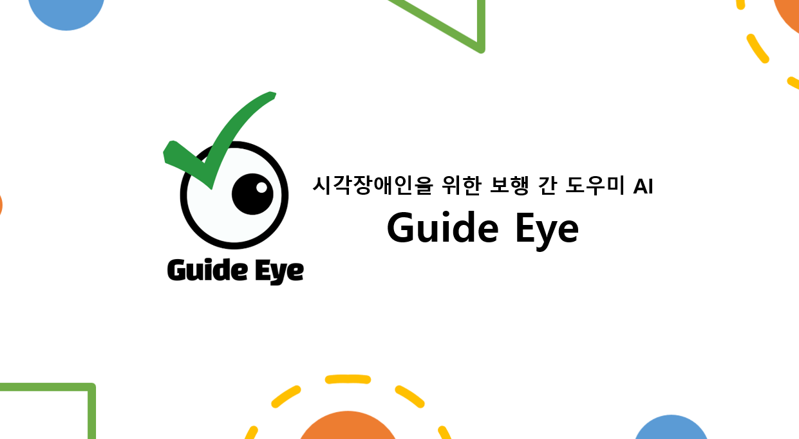

# 솔루션 챌린지

솔루션 챌린지는 구글 기술을 사용하여 UN의 17가지 지속가능한 개발 목표 중 하나 이상을 해결하는 미션으로, 전 세계 GDSC 챕터들이 모두 참여하는 GDSC의 가장 큰 이벤트 중 하나이다. 당연히 우리 고려대학교 GDSC에서도 참여하게 되었고, 그 과정 속에의 여러 경험들을 정리해두고자 한다.

# Guide Eye: 시각장애인 보행 도우미

> 가슴에 모바일 기기(스마트폰)를 부착하고, 실시간으로 보행 중 위험을 워치나 휴대전화 진동과 음성으로 알려주는 서비스
>
> > Flutter(mobile app) + WearOS Kotiln Natvie(wearOs) + tensorflowLite(local AI) + NestJS(API server)

서비스 구상에 팀원들과 많은 시간을 쏟았었던 프로젝트이다. 개발보다는 이걸 어떻게 만들어야 할지에 대해 정말 많은 고민을 하였다. 장애인 분들은 본인이 장애인이라고 특별하게 대우받는 것을 싫어하고, 너무 티가나는 보조용품을 기피한다는 것, 또한 실제로 이것이 도움이 될지 등을 시각장애인협회 등에 문의하고 고민하였다.

그래서 나오게 된 것이 위치가 가슴에 부착하여 기피감을 줄이자는 것(원래는 눈과 비슷하게 목, 어깨, 얼굴 근처 부위였다)과 너무 많은 경고로 피로해지지 않도록 시각장애인의 지팡이가 잘 탐지하지 못하는 골반에서 가슴높이의 장애물과 낙상위험을 집중적으로 체크하자는 것이었다.

UN의 17가지의 지속가능한 목표를 해결하는 미션이니만큼 단순히 개발지식이 아니라 주제로하는 분야의 도메인 지식이 필요하다고 느껴졌으며, 그 대상이 장애인이라 더욱 조심스러웠다.

## 주제를 변경하게 된 이유

> Solution Challenge 2021 Top 3: EYE OF GOD

제출 한달을 남겨두고 All Hands Meeting에서 Guide Eye로 발표를 한 후, 주변 분들에게 아이디어가 좋다는 칭찬을 듣고, 기분좋게 회의를 하던 중 AI파트의 팀원에게서 "이것 좀 봐보라"라는 연락이 왔다. 기획도 끝났고 wearOS쪽은 기획 사항이 간단해 주요 개발사항을 끝마치던 시점에서 큰 문제가 터졌다.

바로, 2년전의 솔루션 챌린지의 Top3 수상작이 우리와 동일한 아이디어였으며, 거기에다 주요 기술인 AI 기술력도 우리팀보다 훨씬 앞서나간 것이었다. 그나마 어떻게 이 아이디어를 살려보려면 우리가 실사용자의 입장에서 고민하였던 "실용성"을 무기로 어필해야 하는데, 그것이 완벽히 겹치는 주제, 부족한 기술력을 뒤집을 만큼의 포인트가 아니라는 생각이 들어서 주제를 바꾸게 되었다. 지금 생각해도 정말 아쉬운 일이다.

# Blood Mate: 지인 지정헌혈 요청 서비스

> 소셜 네트워킹을 통해 빠르게 피를 공급받을 수 있는 서비스
>
> > Flutter(Mobile App) + NestJS(Server)

후보 아이디어로 생각하고 있던 Blood Mate로 개발을 들어갔다. 아이디어는 Guide Eye와 같은 시기에 브레인 스토밍을 하다가 나오긴 하였으나, 1달 남은 시점에서 기획을 구체화하다보니 시간이 많이 모자랐다.

"우귀정님의 가족인 ㅇㅇㅇ님이 수혈이 필요합니다", "ㅁㅁㅁ님의 지인인 우귀정님의 가족인 ㅇㅇㅇ님이 수혈이 필요합니다" 등의 알림을 보낼 수 있게하여, 지인의 지인까지 두 다리를 건너 요청을 보낼 수 있음을 우리의 주요 포인트로 잡았다.

## 결과

> 하지만 우리의 주요 포인트는 이미 다른 커뮤니티 앱을 통해서 충분히 가능한 것들이었고, 또 이미 그렇게 해오고 있었다.

결과는 탈락이었다.

"크게 아쉬웠는가?"라고 물어보면, 계속 스스로 부정해왔지만 속으로는 알고 있었던 것 같다. 이 서비스는 크게 매력있는 서비스는 아니었음을. 3~4일 간의 추가 아이디어 회의를 하긴 하였으나, 매력있는 아이디어는 떠오르지 않았다. 다만 한 달 남은 시점에서 빠르게 뭐라도 만들어야 했고, 팀원들 모두 각자의 일정이 있었기에 아이디어를 더 이상 짜내기란 상당히 힘들었다. 그렇게 개발에 들어갔고 출품하게 되었으며, 솔직히 많이 아쉬움이 남는다.

# 배운 점 및 느낀 점

> 위에서 언급했듯이 아쉬움이 많이 남는 결과와 과정들이었다. 하지만, 아쉬움이 많이 남는다는 것은 배우고 기록할만한 가치가 있다는 뜻이 아닐까?

## 주제 선정과 Wow Point

> 전부터 생각하고는 있었지만, 서비스(아이디어)의 Wow Point가 중요함을 느꼈다.

고려대학교 GDSC에서 3개 팀이 Top100을 그 중 1개 팀은 Top10까지 진출하며, 한국 GDSC 중 최고 성적을 거뒀다고 한다. 좋은 결과를 거둘거라 생각했던 팀들이 떨어지기도, 급하게 준비한 팀들이 좋은 성적을 거두기도 하였다. 그 차이점이 무엇일까 궁금하여, 미팅과 회의 때 가까이에서 봐왔던 팀들이니만큼 그들의 성공요인들을 곰곰히 분석해보았다.

아이디어들을 살펴보니, "해결하고자 하는 주제/문제를 특정"하고 "해당 문제를 명확하게 해결할 수 있음을 증명"하는 서비스들이 좋은 성적을 거뒀다. 올핸즈 미팅 때 보면서 기술력이나 서비스 자체의 완성도를 척도로 보고는 했었는데, 그런것보다는 "특정한 문제 상황을 분명하게 해결할 수 있는 것"이 훨씬 중요하다고 다시 느끼게 되었다.

## 팀 내부 의견 조율

> 과연 이 문제에 정답이 있을까? 확실한 오답만 피해도 잘 대처한 것은 아닐까?

정말 많은 고민을 하였다. 기획이 바뀌게 되면서 AI파트의 팀원은 붕 뜨게 되어서 기획과 잡일을 맡게 되기도 하였으며, 개발에서도 앱 개발의 로드가 꽤 커서 부담이 집중되기도 하였다. 또, 팀원들의 목표가 다 다를 수도 있다. 누군가는 참가에 의의를, 누군가는 Top3를 목표로 할 수도 있는 것이며, 또 중간에 의욕이 식기도 한다. 이를 어떻게 조율해야 하는가? 고민은 정말 많이 하였지만 무엇이 옳은지 아직은 모르겠다. 아니, "옳다"고 말할 수 있는 것이 있을까?
