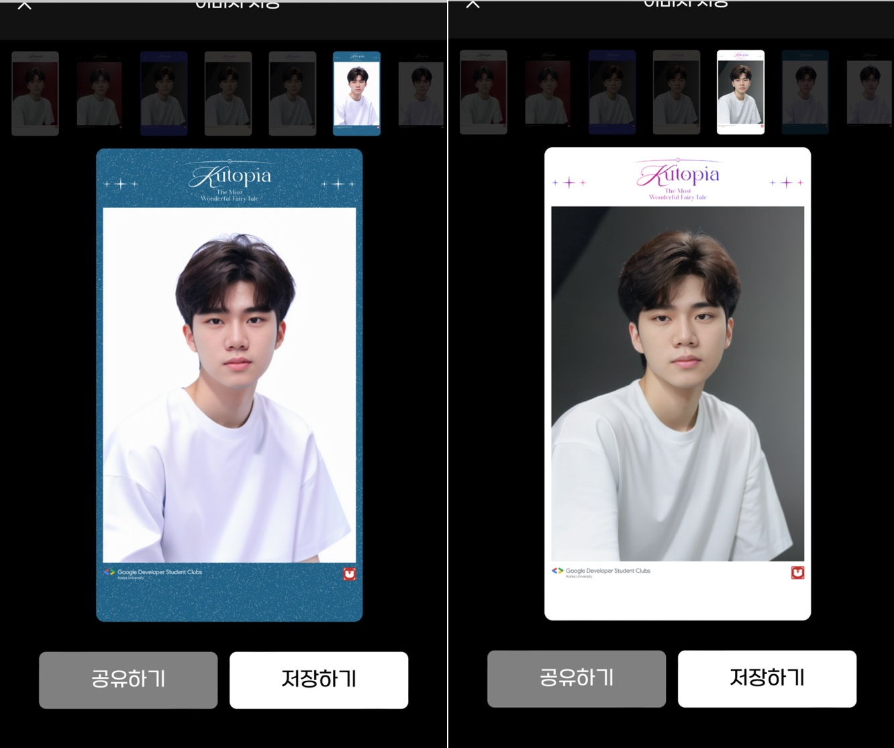
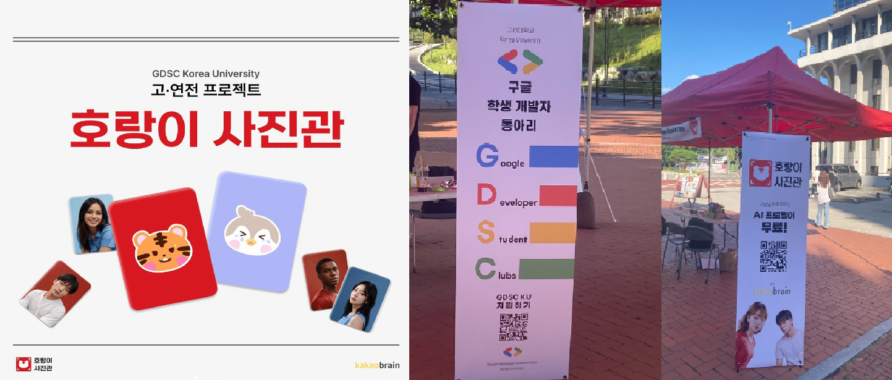
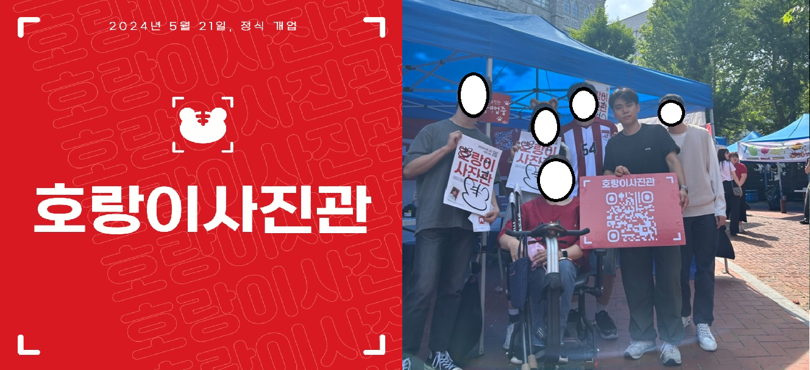

이 글은 호랑이 사진관 프로젝트에 대한 전반적인 회고이다. 서비스의 성과와 프로젝트를 진행하며 배운 점과 느낀 점, 아쉬웠던 경험 등을 정리하였다.

사실 이번 프로젝트는 나름 고생을 해서, 프로젝트가 끝나니 온 몸이 퍼지고 꽤나 힘든 일명 번아웃과 비슷한 상태가 되었다. 하지만 오히려 그 만큼 나에겐 꽤나 큰 의미가 있었던 프로젝트이고, 그 과정에서 기술적인 내용 뿐만 아니라 경험적으로도 배운 점이 많았기에 꼭 정리를 해두려고 한다.

항상 그렇지만, 이렇게 정리해두는 이유는 성과를 기록해두기 위함이기도 하며, 프로젝트를 하며 배우고 느끼고 경험한 점들을 정리하고 잊지 않기 위함이다. 특히 GDSC 내에서 가장 크게 준비하고 운영한 프로젝트를 리딩하면서 경험하고 배운 것들이 너무 소중하였다.

# 호랑이 사진관이 무슨 서비스인가요?

호랑이 사진관은 GDSC 고려대학교에서 운영한 이벤트 성 서비스로 본인의 사진을 업로드하면, AI가 프로필 사진을 생성해주는 서비스이다. SNOW의 AI 프로필 서비스를 생각하면 이해가 편할 듯 하다.

(서비스를 2023년도 고연전과 2024년도 고려대 대동제 두 번에 걸쳐서 오픈하였다.)

> 고연전과 대동제의 컨셉에 맞춘 프로필 사진을 제공하였다.

위 사진은 faceswap을 기반으로 한 2023년도의 결과물이고, 아래 사진은 controlNet과 reactor를 기반으로 한 2024년도의 결과물이다. 확실히 2024년도의 사진들이 더욱 실물과 닮았고, 안정성이 높다. 여담이지만, 여성 유저들의 경우에는 남성보다 퀄리티가 뛰어났었다.

## 2023년도 고연전

> 사실은 어쩌다보니 갑작스럽게 아이디어가 나와서 만들어낸 프로젝트가 호랑이 사진관이었다.

FE 한 명, BE 한 명, AI는 세 명이서 프로젝트를 개발하게 되었는데, 그러다보니 개발 기간도 짧았고 인력도 상당히 부족하게 된 상황이었다.

부스 운영과 같은 것들은 GDSC 내부의 데브렐 팀에서 도와줘서 잘 진행이 되었지만, 확실히 짧은 개발기간과 부족한 인력으로 하다보니 말이 안되는 스케줄이 나오기도 하였다.

하지만 그렇기에 오히려 더욱 끈끈하게 개발할 수 있었고 개발 및 운영하던 당시에 우여곡절도 정말 많았지만, 다 추억으로 얘기할 수 있는 거리들이 많이 나왔던것 같다.

## 2024년도 대동제

> 24년도에도 조금은 갑작스럽게 기존 서비스를 업그레이드 했지만 작년과는 상황이 많이 달라져 있었다.

GDSC 고려대학교 내부의 많은 사람들이 작년에 호랑이 사진관이 배포되고 운영되는 모습들을 보면서 이 프로젝트에 관심을 가지고 있었고, 참여하겠다는 사람들이 많았던 것이다.

작년보다는 훨씬 많은 인원과 기존의 서비스를 기반으로 운영하는 작업이다보니 확실히 스케줄은 여유로웠다. 실제로 많은 부분이 개선 되었으며, 이는 작년과 비교해 UX/UI의 측면과 AI 성능 측면에서 확연히 느낄 수 있었다.

하지만 약간 안타까운 점은, 사람이 많아지다보니 학부 프로젝트의 끈끈함이나 친목보다는 조금 더 체계적인 '일/업무'처럼 느껴진 것, 그런 시스템이 잡혀버린 상태로 프로젝트가 진행된 것이 아쉬웠다.

# 프로젝트의 결과

결과적으로 호랑이 사진관은 2023년도 고연전에는 약 1000명의 유저를 받았고, 2024년도 대동제에서는 2500의 유저를 받았다. 그래도 고려대학교 내부에서 진행된 프로젝트 치고는 꽤나 높은 이용률이지 않나 생각했다. 물론 인스타 스토리에서 유행을 해서 더 많은 수의 이용자를 바라보는 꿈을 꾸지 않은 것은 아니지만, 해당 수치는 주변과 비교해봤을 때 꽤나 성공적임을 느꼈다.

## (개인적으로) 느낀 점

나중에 프로젝트를 마무리하고 팀원(아주 친한 친구)과 나눈 말이었는데, 사실 이 프로젝트는 하면서 육체적으로는 분명 힘들었지만, 하는 과정들이 너무 재미있었다. 분명 밤을 자주 샜고 고생했지만, 내가 하고 싶은 것들을 하니, 프로젝트를 오픈했을 때를 기대하며 정신적으로는 그렇게 힘들지 않았던 것 같다.

오히려 나름 재미있었다. 멤버들과 친해지는 것도 그렇고 친한 멤버들과 함께 있으니 개발하며 고생하는 과정들도 재미있었다. 객관적으로 힘든 스케줄을 어떻게 재미있게 할 수 있었을까를 고민해봤는데, 내가 즐겨서 그런 것 같다. 이 점이 나를 좀 띵하게 만들었다.

한 동안 하기 싫은... 공부를 해야만 했으니, 분명 재미도 없고 하기가 너무 싫어서 미칠 것 같았는데, 그것과 너무 대비되는 경험이 아닌가. '나는 정말 즐길 수 있는 일을 할 때, 일을 할 수 있는 사람이구나.' 라는 점들을 느낄 수 있었다.

그리고 2024년도 대동제 이벤트를 할 때는 솔직히 조금 즐기지 못해서 아쉽다. 인턴과 겹치면서 그 과정을 온전히 즐기지는 못했고, 오히려 결과(수치)를 보며 마음 아파했었던 내가 조금 밉다. 친한 멤버들과 같이 개발하는 그 과정을 즐겼어야만 했는데, 그 때의 내가 너무 아쉽다.
